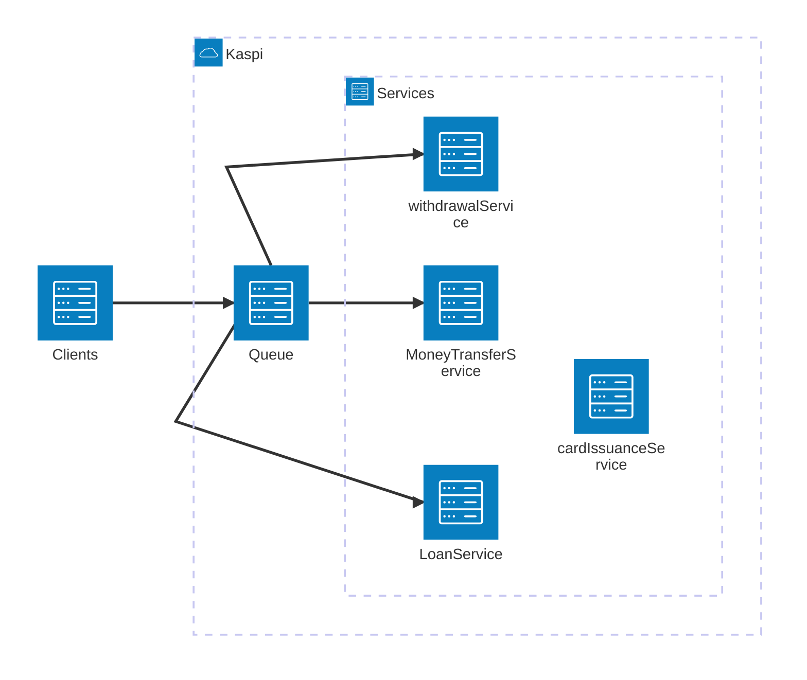

<h1>Kaspi Bank Branches</h1>

<h2>Give system design and requirements</h2>



<ol>
<li>Improve throuhput of system</li>
</ol>

<h2>Possible solutions</h2>

``` mermaid

flowchart LR
	subgraph Kaspi
    subgraph Queue
	    queue1[Queue for service 1]
	    queue2[Queue for service 2]
	    queue3[Queue for service 3]
	    queue4[Queue for service 4]
	    queue5[Queue for service 5]
    end
    subgraph Servers
	    service1[Loans]
	    service2[Money transfers]
	    service3[Card issuance]
	    service4[Cash withdrawals]
	    service5[Money exchange]
    end
		load[LoadBalancer]
		gateway[API Gateway]
  end
  clients[\clients\]
  clients --> gateway --> load --> queue1
  load --> queue2
  load --> queue3
  load --> queue4
  load --> queue5
  queue1 --> service1
  queue2 --> service2
  queue3 --> service3
  queue4 --> service4
  queue5 --> service5
 
 ```

